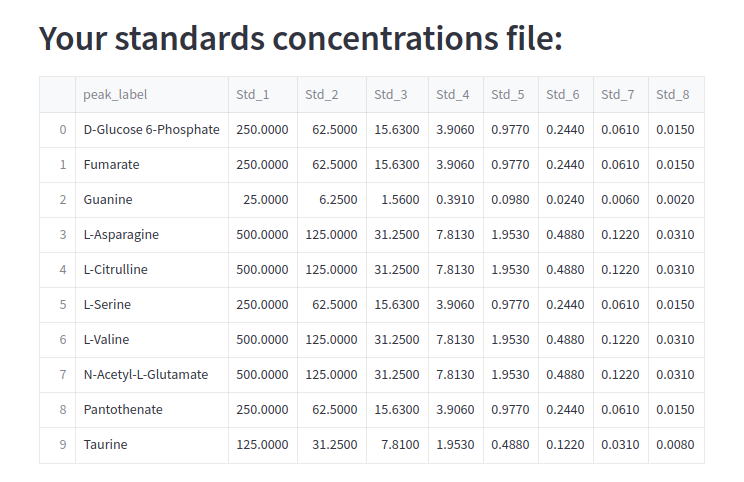

# ms-conc and Scalir

This repository contains an app for standardizing metabolomics data by using standard samples that incorporates a novel algorithm for detecting linear ranges in a set of (x,y) points covering several orders of magnitude. The algorithm uses the log-scale to perform a search of the linear range by iteratively fitting a linear curve to the set of points. The points that are further from the fitted curve are removed from the range until reaching a proper fitting. The parameters controlling the goodness of fit and the criteria for stopping the iterative points elimination were selected by using mass spectrometry (MS) generated metabolomics data. Although the app is meant to use MS data, it can be used to standardize data with similar structure. The app can be used freely online at https://lewisresearchgroup-ms-conc-streamlit-app-w9e64f.streamlit.app/, or locally by cloning this repo. Running localy allows for modifying parameters controlling the algorithm performance to better adjust your data.

The first step in the app is to provide data about the peaks for each metabolite and metabolites concentrations in the different standard samples. 

The data of peak intensities can be obtained from Maven or MINT programs (this information should be especified). The data should be provided in tables (.csv or .xlsx extensions). 
Sample tables in the proper format can also be downloaded. 

The app will display the head of the tables after successfuly providing the peak intensities and standard information tables. 

